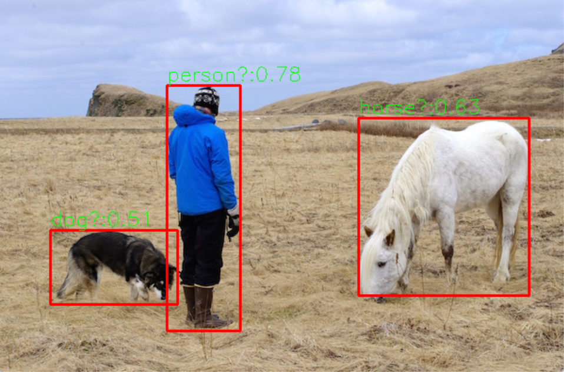

<h3>deeplearn-cpp</h3>

<table border="1">
  <tr>
    <th></th>
  </tr>
</table>

<table class="table"><thead><tr><th>编号</th><th>项目</th><th>说明</th></tr></thead><tbody>
<tr><td>1</td><td>AnimeGAN-onnxruntime</td><td>人脸动漫化——AnimeGAN
</td></tr>
<tr><td>2</td><td>bytetrack-opencv-onnxruntime</td><td>YOLOX+ByteTrack目标跟踪（含mp4视频）

</td></tr>
<tr><td>3</td><td>centernet-opencv-onnxrun-cpp</td><td>CenterNet目标检测  CenterNet是典型的"Objects as Points"式的anchor-free系列的目标检测
</td></tr>
<tr><td>4</td><td>crowdcounting-p2pnet-opencv</td><td>P2PNet人群检测和计数 《Rethinking Counting and Localization in Crowds:A Purely Point-Based Framework》。
</td></tr>
<tr><td>5</td><td>DAMO-YOLO-detect-onnxrun-cpp</td><td>DAMO-YOLO目标检测
</td></tr>
<tr><td>6</td><td>dbnet-barcode</td><td>dbnet-barcode 条形码识别
</td></tr>
<tr><td>7</td><td>dbnet-opencv-cpp</td><td>DBNet文字检测
</td></tr>
<tr><td>8</td><td>Dense-Head-Pose-Estimation-Face-Mesh-3D-Face-Rec</td><td>3D人脸重建，人脸Mesh，人头姿势估计
</td></tr>
<tr><td>9</td><td>DirectMHP-onnxrun</td><td>全范围角度2D多人头部姿势估计  ort推理
</td></tr>
<tr><td>10</td><td>DirectMHP-opencv</td><td>全范围角度2D多人头部姿势估计  opencv-dnn推理
</td></tr>
<tr><td>11</td><td>DIS-opencv-onnxrun</td><td>DIS高精度图像二类分割
</td></tr>
<tr><td>12</td><td>E2Pose-detect-onnxrun-cpp</td><td>E2Pose人体关键点检测
</td></tr>
<tr><td>13</td><td>FaceMaskDetection-dnn</td><td>人脸口罩检测
</td></tr>
<tr><td>14</td><td>faster-rcnn-card-opencv</td><td>faster-rcnn检测证件照
</td></tr>
<tr><td>15</td><td>FastestDet-opencv-dnn</td><td>《FastestDet: 比yolo-fastest更快！更强！更简单！全新设计的超实时Anchor-free目标检测算法》
</td></tr>
<tr><td>16</td><td>FreeYOLO-opencv-onnxrun-cpp</td><td>FreeYOLO目标检测 有COCO目标检测，人脸检测，密集行人检测的三种检测
</td></tr>
<tr><td>17</td><td>HAWP-onnxrun-cpp</td><td>HAWP线框检测 CVPR 2020里有一篇文章《Holistically-Attracted Wireframe Parsing》
</td></tr>
<tr><td>18</td><td>hybridnets-opencv-dnn</td><td>HybridNets，同时处理车辆检测、可驾驶区域分割、车道线分割（opencv-dnn推理）
</td></tr>
<tr><td>19</td><td>informative-drawings-onnxrun-cpp</td><td>Informative-Drawings生成素描画 paper是cvpr2022的一篇文章《Learning to generate line drawings that convey geometry and semantics》
</td></tr>
<tr><td>20</td><td>LDC-onnxrun-cpp</td><td>边缘检测的轻量级密集卷积神经网络 ort部署
</td></tr>
<tr><td>21</td><td>libface-detect-recognition</td><td>人脸检测+人脸特征提取+相似度计算+关键点检测+人脸对齐（方法较为古老请看最新）
</td></tr>
<tr><td>22</td><td>libface-sface_detect-recognition-opencv</td><td>libface人脸检测和SFace人脸识别
</td></tr>
<tr><td>23</td><td>license-plate-detect-recoginition-opencv</td><td>使用opencv-dnn 部署 lprNet 深度学习车牌检测与识别
</td></tr>
<tr><td>24</td><td>LSTR-lane-detect-onnxrun-cpp</td><td>LSTR基于Transformer的端到端实时车道线检测
</td></tr>
<tr><td>25</td><td>M-LSD-onnxrun-cpp</td><td>轻量实时的M-LSD直线检测
</td></tr>
<tr><td>26</td><td>multiyolov5-opencv-onnxrun</td><td>yolov5目标检测+语义分割
</td></tr>
<tr><td>27</td><td>nanodet-opncv-dnn-cpp</td><td>nanodet目标检测
</td></tr>
<tr><td>28</td><td>nanodet-plus-opencv</td><td>NanoDet-Plus目标检测
</td></tr>
<tr><td>29</td><td>ocr-opencv-dnn</td><td>OCR：文本检测用的是EAST，文本识别用的是CRNN
</td></tr>
<tr><td>30</td><td>PaddleOCR-v3-onnxrun-cpp-py</td><td>PaddlePaddle团队的PaddleOCR项目
</td></tr>
<tr><td>31</td><td>photo2cartoon-onnxrun-cpp</td><td>部署StyleGAN人像卡通画 ,输入图片是人像大头照，如果输入图片里包含太多背景，需要先做人脸检测+人脸矫正
</td></tr>
<tr><td>32</td><td>picodet-onnxruntime</td><td>PicoDet目标检测
</td></tr>
<tr><td>33</td><td>polygonyolov5-opencv-onnxrun</td><td>yolov5不规则四边形目标检测
</td></tr>
<tr><td>34</td><td>PP-HumanSeg-opencv-onnxrun</td><td>PP-HumanSeg肖像分割模型
</td></tr>
<tr><td>35</td><td>PP-MattingV2-onnxrun-cpp</td><td>百度PaddleSeg发布的实时人像抠图模型PP-MattingV2
</td></tr>
<tr><td>36</td><td>PP-Vehicle-onnxrun-cpp</td><td>百度飞桨开源PP-Vehicle车辆分析，包含车辆检测，识别车型和车辆颜色，车牌检测，车牌识别5个功能
</td></tr>
<tr><td>37</td><td>pp-yoloe-hrnet-human_pose_estimation</td><td>PaddleDetection 中 PP-Human， PP-YOLOE行人检测+HRNet人体骨骼关键点检测
</td></tr>
<tr><td>38</td><td>pp-yoloe-onnxrun-cpp</td><td>PP-YOLOE目标检测
</td></tr>
<tr><td>39</td><td>PP-YOLOE-Plus-detect-onnxrun-cpp</td><td>百度飞桨开源PP-YOLOE-Plus目标检测
</td></tr>
<tr><td>40</td><td>robustvideomatting-onnx</td><td>鲁棒性视频抠图（PeterL1n发布）
</td></tr>
<tr><td>41</td><td>rotate-yolov5-opencv-onnxrun</td><td>yolov5旋转目标检测
</td></tr>
<tr><td>42</td><td>rotateyolov5-opencv-onnxrun</td><td>yolov5旋转目标检测
</td></tr>
<tr><td>43</td><td>scrfd-opencv</td><td>SCRFD人脸检测 SCRFD是一个FCOS式的人脸检测器，2021年5月发出来的（高效率高精度人脸检测算法，速度和精度相比其他算法都有提升）
</td></tr>
<tr><td>44</td><td>u2net-onnxruntime</td><td>U-2-Net生成人脸素描画
</td></tr>
<tr><td>45</td><td>Ultra-Fast-Lane-Detection-v2-onnxrun</td><td>Ultra-Fast-Lane-Detection-v2车道线检测   ort部署
</td></tr>
<tr><td>46</td><td>yolact-opencv-dnn-cpp</td><td>yolact 实例分割

</td></tr>
<tr><td>47</td><td>yolo-fastestv2-opencv</td><td># yolo-fastestv2-opencv
使用OpenCV部署Yolo-FastestV2，包含C++和Python两种版本的程序

根据运行体验，这套程序的运行速度真的很快，而且模型文件也很小，可以直接上传到仓库里，
不用再从百度云盘下载的。
</td></tr>
<tr><td>48</td><td>yolo-qrcode-opencv</td><td>OLOV3检测二维码
</td></tr>
<tr><td>49</td><td>YOLOP-opencv-dnn</td><td>全景驾驶感知网络YOLOP，同时处理交通目标检测、可驾驶区域分割、车道线检测
</td></tr>
<tr><td>50</td><td>yolopv2-opencv-onnxrun-cpp</td><td>YOLOPV2目标检测+可驾驶区域分割+车道线分割
</td></tr>
<tr><td>51</td><td>yolov34-cpp-opencv-dnn</td><td>经典的YOLOv3，YOLOv4，Yolo-Fastest和YOLObile这4种YOLO目标检测的实现
</td></tr>
<tr><td>52</td><td>yolov5-detect-car_plate_corner</td><td>yolov5检测车牌和4个角点
</td></tr>
<tr><td>53</td><td>yolov5-face-landmarks-opencv</td><td>yolov5检测人脸和关键点
</td></tr>
<tr><td>54</td><td>yolov5-face-landmarks-opencv-v2</td><td>yolov5检测人脸和关键点
</td></tr>
<tr><td>55</td><td>yolov5-lite-onnxruntime</td><td>yolov5-lite目标检测
</td></tr>
<tr><td>56</td><td>yolov5-v6.1-opencv-onnxrun</td><td>yolov5-v6.1目标检测
</td></tr>
<tr><td>57</td><td>yolov5_pose_opencv</td><td>yolov5-pose目标检测+人体姿态估计。支持yolov5s，yolov5m，yolov5l
</td></tr>
<tr><td>58</td><td>yolov6-opencv-onnxruntime</td><td>YOLOV6目标检测
</td></tr>
<tr><td>59</td><td>yolov7-detect-face-onnxrun-cpp</td><td>YOLOV7人脸+关键点检测
</td></tr>
<tr><td>60</td><td>yolov7-head-detect-onnxrun-cpp</td><td>YOLOV7人头检测
</td></tr>
<tr><td>61</td><td>yolov7-opencv-onnxrun-cpp</td><td>YOLOV7目标检测
</td></tr>
<tr><td>62</td><td>yolov8-face-landmarks-opencv-dnn</td><td>yolov8-face-landmarks-opencv-dnn 人脸检测、5点

</td></tr>
<tr><td>63</td><td>yolox-opencv-dnn</td><td>OpenCV部署YOLOX，支持YOLOX-S、YOLOX-M、YOLOX-L、YOLOX-X、YOLOX-Darknet53五种结构
</td></tr>
</tbody></table>

